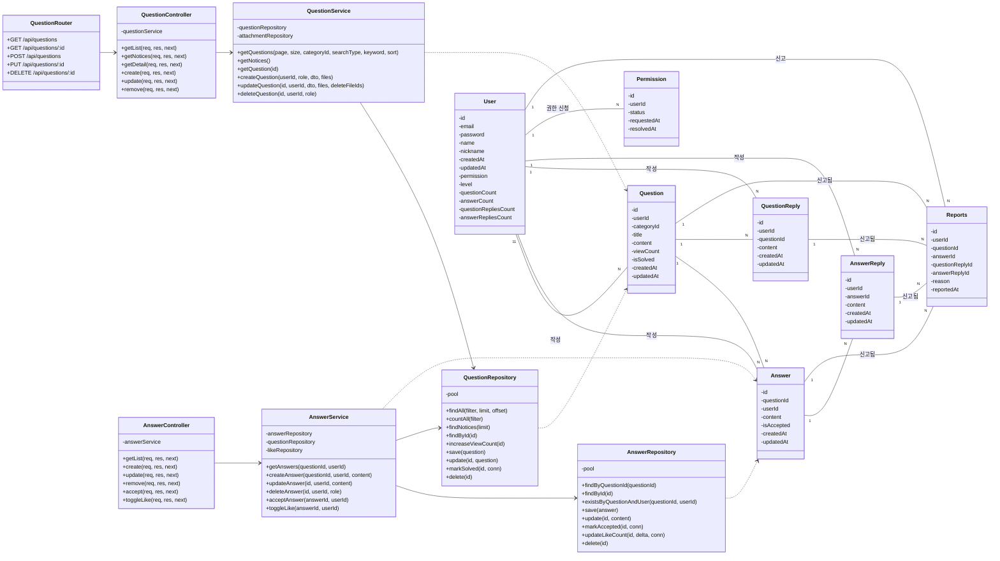

```mermaid
classDiagram
    direction LR

    class QuestionRouter {
        +GET /api/questions
        +GET /api/questions/:id
        +POST /api/questions
        +PUT /api/questions/:id
        +DELETE /api/questions/:id
    }
    class QuestionController {
        -questionService
        +getList(req, res, next)
        +getNotices(req, res, next)
        +getDetail(req, res, next)
        +create(req, res, next)
        +update(req, res, next)
        +remove(req, res, next)
    }
    class QuestionService {
        -questionRepository
        -attachmentRepository
        +getQuestions(page, size, categoryId, searchType, keyword, sort)
        +getNotices()
        +getQuestion(id)
        +createQuestion(userId, role, dto, files)
        +updateQuestion(id, userId, dto, files, deleteFileIds)
        +deleteQuestion(id, userId, role)
    }
    class QuestionRepository {
        -pool
        +findAll(filter, limit, offset)
        +countAll(filter)
        +findNotices(limit)
        +findById(id)
        +increaseViewCount(id)
        +save(question)
        +update(id, question)
        +markSolved(id, conn)
        +delete(id)
    }

    class AnswerController {
        -answerService
        +getList(req, res, next)
        +create(req, res, next)
        +update(req, res, next)
        +remove(req, res, next)
        +accept(req, res, next)
        +toggleLike(req, res, next)
    }
    class AnswerService {
        -answerRepository
        -questionRepository
        -likeRepository
        +getAnswers(questionId, userId)
        +createAnswer(questionId, userId, content)
        +updateAnswer(id, userId, content)
        +deleteAnswer(id, userId, role)
        +acceptAnswer(answerId, userId)
        +toggleLike(answerId, userId)
    }
    class AnswerRepository {
        -pool
        +findByQuestionId(questionId)
        +findById(id)
        +existsByQuestionAndUser(questionId, userId)
        +save(answer)
        +update(id, content)
        +markAccepted(id, conn)
        +updateLikeCount(id, delta, conn)
        +delete(id)
    }

    class User {
        -id
        -email
        -password
        -name
        -nickname
        -createdAt
        -updatedAt
        -permission
        -level
        -questionCount
        -answerCount
        -questionRepliesCount
        -answerRepliesCount
    }
    class Question {
        -id
        -userId
        -categoryId
        -title
        -content
        -viewCount
        -isSolved
        -createdAt
        -updatedAt
    }
    class Answer {
        -id
        -questionId
        -userId
        -content
        -isAccepted
        -createdAt
        -updatedAt
    }
    class QuestionReply {
        -id
        -userId
        -questionId
        -content
        -createdAt
        -updatedAt
    }

    class AnswerReply {
        -id
        -userId
        -answerId
        -content
        -createdAt
        -updatedAt
    }

    class Permission {
        -id
        -userId
        -status
        -requestedAt
        -resolvedAt
    }

    class Reports {
        -id
        -userId
        -questionId
        -answerId
        -questionReplyId
        -answerReplyId
        -reason
        -reportedAt
    }

    QuestionRouter --> QuestionController
    QuestionController --> QuestionService
    QuestionService --> QuestionRepository
    AnswerController --> AnswerService
    AnswerService --> AnswerRepository
    AnswerService --> QuestionRepository

    QuestionService ..> Question
    QuestionRepository ..> Question
    AnswerService ..> Answer
    AnswerRepository ..> Answer

    User "1" -- "N" Question : 작성
    User "1" -- "N" Answer : 작성
    User "1" -- "N" QuestionReply : 작성
    User "1" -- "N" AnswerReply : 작성
    User "1" -- "N" Permission : 권한 신청
    User "1" -- "N" Reports : 신고

    Question "1" -- "N" Answer
    Question "1" -- "N" QuestionReply
    Answer "1" -- "N" AnswerReply

    Question "1" -- "N" Reports : 신고됨
    Answer "1" -- "N" Reports : 신고됨
    QuestionReply "1" -- "N" Reports : 신고됨
    AnswerReply "1" -- "N" Reports : 신고됨
```
