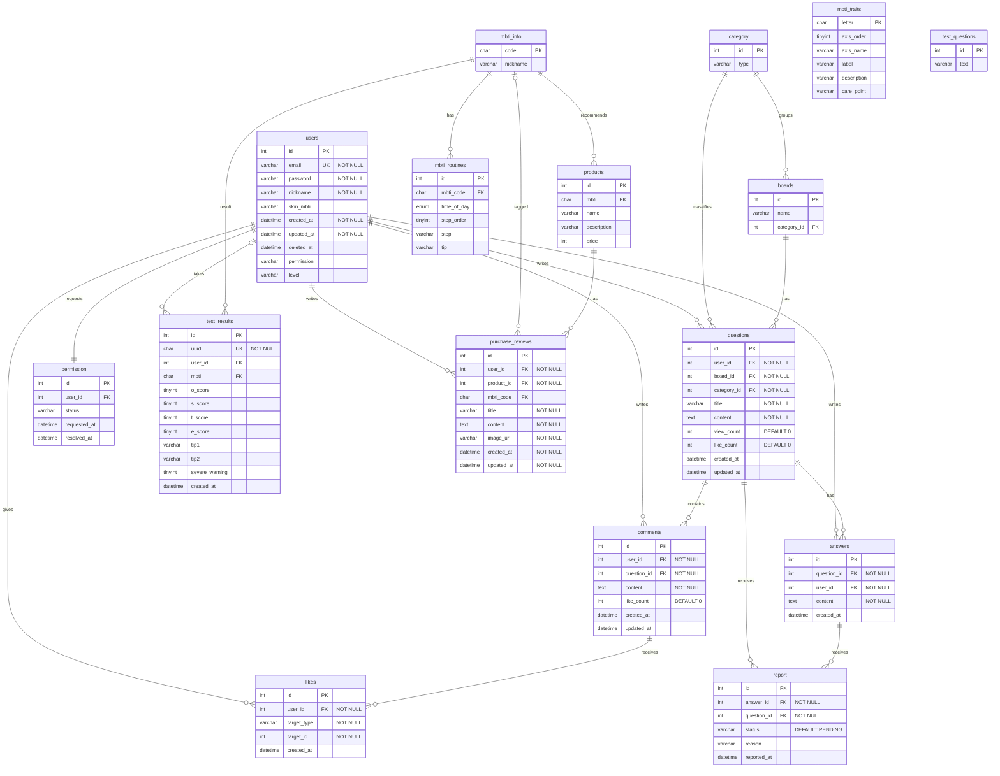

```mermaid
erDiagram
    %% ===== 회원 =====
    users ||--o{ questions : writes
    users ||--o{ answers : writes
    users ||--o{ comments : writes
    users ||--o{ likes : gives
    users ||--|| permission : requests
    users |o--o{ test_results : takes
    users ||--o{ purchase_reviews : writes

    %% ===== 게시판 =====
    category ||--o{ boards : groups
    category ||--o{ questions : classifies
    boards ||--o{ questions : has
    questions ||--o{ answers : has
    questions ||--o{ comments : contains
    comments ||--o{ likes : receives
    questions ||--o{ report : receives
    answers ||--o{ report : receives

    %% ===== 피부 MBTI =====
    mbti_info ||--o{ mbti_routines : has
    mbti_info ||--o{ test_results : result
    mbti_info ||--o{ products : recommends
    mbti_info |o--o{ purchase_reviews : tagged

    %% ===== 상품 =====
    products ||--o{ purchase_reviews : has

    users {
        int id PK
        varchar email UK "NOT NULL"
        varchar password "NOT NULL"
        varchar nickname "NOT NULL"
        varchar skin_mbti
        datetime created_at "NOT NULL"
        datetime updated_at "NOT NULL"
        datetime deleted_at
        varchar permission
        varchar level
    }

    permission {
        int id PK
        int user_id FK
        varchar status
        datetime requested_at
        datetime resolved_at
    }

    category {
        int id PK
        varchar type
    }

    boards {
        int id PK
        varchar name
        int category_id FK
    }

    questions {
        int id PK
        int user_id FK "NOT NULL"
        int board_id FK "NOT NULL"
        int category_id FK "NOT NULL"
        varchar title "NOT NULL"
        text content "NOT NULL"
        int view_count "DEFAULT 0"
        int like_count "DEFAULT 0"
        datetime created_at
        datetime updated_at
    }

    answers {
        int id PK
        int question_id FK "NOT NULL"
        int user_id FK "NOT NULL"
        text content "NOT NULL"
        datetime created_at
    }

    comments {
        int id PK
        int user_id FK "NOT NULL"
        int question_id FK "NOT NULL"
        text content "NOT NULL"
        int like_count "DEFAULT 0"
        datetime created_at
        datetime updated_at
    }

    likes {
        int id PK
        int user_id FK "NOT NULL"
        varchar target_type "NOT NULL"
        int target_id "NOT NULL"
        datetime created_at
    }

    report {
        int id PK
        int answer_id FK "NOT NULL"
        int question_id FK "NOT NULL"
        varchar status "DEFAULT PENDING"
        varchar reason
        datetime reported_at
    }

    mbti_info {
        char code PK
        varchar nickname
    }

    mbti_traits {
        char letter PK
        tinyint axis_order
        varchar axis_name
        varchar label
        varchar description
        varchar care_point
    }

    mbti_routines {
        int id PK
        char mbti_code FK
        enum time_of_day
        tinyint step_order
        varchar step
        varchar tip
    }

    test_questions {
        int id PK
        varchar text
    }

    test_results {
        int id PK
        char uuid UK "NOT NULL"
        int user_id FK
        char mbti FK
        tinyint o_score
        tinyint s_score
        tinyint t_score
        tinyint e_score
        varchar tip1
        varchar tip2
        tinyint severe_warning
        datetime created_at
    }

    products {
        int id PK
        char mbti FK
        varchar name
        varchar description
        int price
    }

    purchase_reviews {
        int id PK
        int user_id FK "NOT NULL"
        int product_id FK "NOT NULL"
        char mbti_code FK
        varchar title "NOT NULL"
        text content "NOT NULL"
        varchar image_url "NOT NULL"
        datetime created_at "NOT NULL"
        datetime updated_at "NOT NULL"
    }
```
